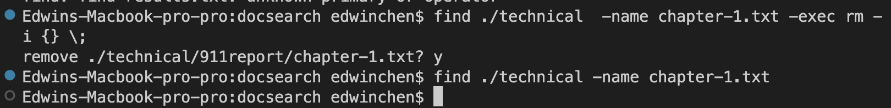
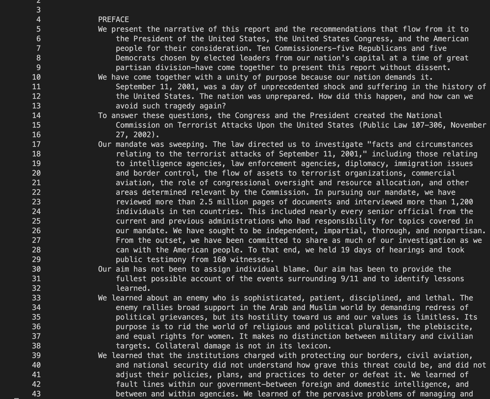
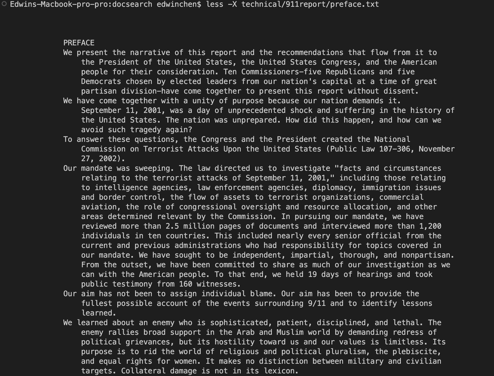
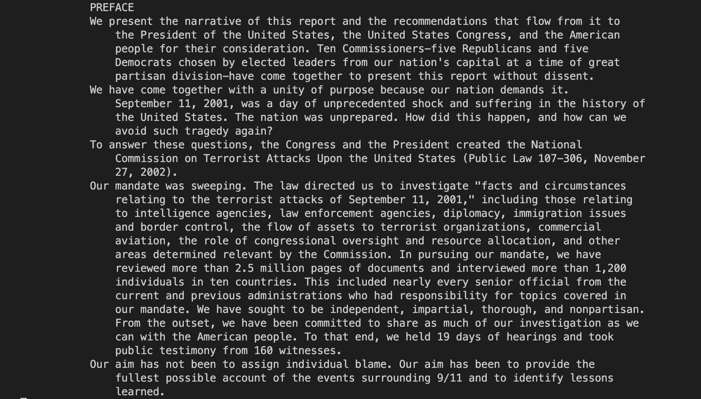
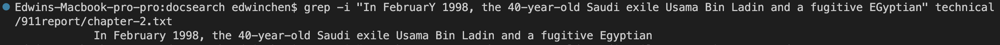
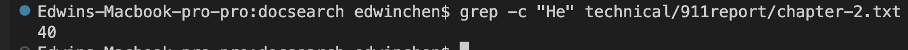
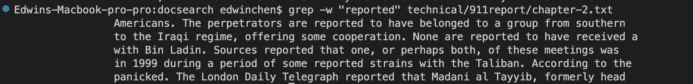

# Week 5 lab report
# find commands
Example1: ```find ./technical -name chapter-1.txt```<br> 

The output: ```./technical/911report/chapter-1.txt```<br> 

The picture of the this example: <br>


Explanation: What this command does is finding a specific file in the directory and print out all the path. In this example we search chapter-1.txt and get ./technical/911report/chapter-1.txt, so we know it is in the 911report. It is useful because we can know where the file we want to search belong.<br> 

Example2: ```find ./technical  -name chapter-1.txt -exec rm -i {} \;```<br>

The output: ```remove ./technical/911report/chapter-1.txt? y```<br> 

The picture of this example:


Explanation: This command let us remove a specific file in the directory and it will confirm again with you, when you type 'y' or 'Y' you will delete it. And finally we search if the file chapter-1.txt is still there using ```find ./technical -name chapter-1.txt``` , and it disappeared already. This is useful becasue we can delete some files we don't need in the terminal.<br>

Example3: ```find ./technical  -empty```<br>
The output:<br>
The picture of this example:

Explanation: This command search the empty file in the directory, and since we don't have any empty files in it, the output shows nothing. It is useful because we can instanty know is there any empty file in the directory.

# less commands
Example1: ```less -N technical/911report/preface.txt```<br> 

The output: Becasue the output might be too long so we start from line 67.<br>
```
     67                 built. They have given good advice, and faithfully carried out our guidance. They
     68                 have been superb. We thank the Congress and the President. Executive branch agencies
     69                 have searched records and produced a multitude of documents for us. We thank
     70                 officials, past and present, who were generous with their time and provided us with
     71                 insight. The PENTTBOM team at the FBI, the Director's Review Group at the CIA, and
     72                 Inspectors General at the Department of Justice and the CIA provided great
     73                 assistance. We owe a huge debt to their investigative labors, painstaking attention
     74                 to detail, and readiness to share what they have learned. We have built on the work
     75                 of several previous Commissions, and we thank the Congressional Joint Inquiry, whose
     76                 fine work helped us get started. We thank the City of New York for assistance with
     77                 documents and witnesses, and the Government Printing Office and W.W. Norton
     78                 & Company for helping to get this report to the broad public.
     79             We conclude this list of thanks by coming full circle: We thank the families of 9/11,
     80                 whose persistence and dedication helped create the Commission. They have been with
     81                 us each step of the way, as partners and witnesses. They know better than any of us
     82                 the importance of the work we have undertaken.
     83             We want to note what we have done, and not done. We have endeavored to provide the
     84                 most complete account we can of the events of September 11, what happened and why.
     85                 This final report is only a summary of what we have done, citing only a fraction of
     86                 the sources we have consulted. But in an event of this scale, touching so many
     87                 issues and organizations, we are conscious of our limits. We have not interviewed
     88                 every knowledgeable person or found every relevant piece of paper. New information
     89                 inevitably will come to light. We present this report as a foundation for a better
     90                 understanding of a landmark in the history of our nation.
     91             We have listened to scores of overwhelming personal tragedies and astounding acts of
     92                 heroism and bravery. We have examined the staggering impact of the events of 9/11 on
     93                 the American people and their amazing resilience and courage as they fought back. We
     94                 have admired their determination to do their best to prevent another tragedy while
     95                 preparing to respond if it becomes necessary. We emerge from this investigation with
     96                 enormous sympathy for the victims and their loved ones, and with enhanced respect
     97                 for the American people. We recognize the formidable challenges that lie ahead.
     98             We also approach the task of recommendations with humility. We have made a limited
     99                 number of them. We decided consciously to focus on recommendations we believe to be
    100                 most important, whose implementation can make the greatest difference. We came into
    101                 this process with strong opinions about what would work. All of us have had to
    102                 pause, reflect, and sometimes change our minds as we studied these problems and
    103                 considered the views of others. We hope our report will encourage our fellow
    104                 citizens to study, reflect-and act.
    105             Thomas H. Kean, chair
    106             Lee H. Hamilton, vice chair
    107         
    108     
(END)
 ```

The picture of the this example:


Explanation:
This command can show the line number in the file, it is useful because you can see how many lines in that files and in certain cases you can get a lot of information from that, such as when every line has one student's name, and you can know how many students are there.

Example2: ```less -X technical/911report/preface.txt```<br> 

The output:
```
            PREFACE
            We present the narrative of this report and the recommendations that flow from it to
                the President of the United States, the United States Congress, and the American
                people for their consideration. Ten Commissioners-five Republicans and five
                Democrats chosen by elected leaders from our nation's capital at a time of great
                partisan division-have come together to present this report without dissent.
            We have come together with a unity of purpose because our nation demands it.
                September 11, 2001, was a day of unprecedented shock and suffering in the history of
                the United States. The nation was unprepared. How did this happen, and how can we
                avoid such tragedy again?
            To answer these questions, the Congress and the President created the National
                Commission on Terrorist Attacks Upon the United States (Public Law 107-306, November
                27, 2002).
            Our mandate was sweeping. The law directed us to investigate "facts and circumstances
                relating to the terrorist attacks of September 11, 2001," including those relating
                to intelligence agencies, law enforcement agencies, diplomacy, immigration issues
                and border control, the flow of assets to terrorist organizations, commercial
                aviation, the role of congressional oversight and resource allocation, and other
                areas determined relevant by the Commission. In pursuing our mandate, we have
                reviewed more than 2.5 million pages of documents and interviewed more than 1,200
                individuals in ten countries. This included nearly every senior official from the
                current and previous administrations who had responsibility for topics covered in
                our mandate. We have sought to be independent, impartial, thorough, and nonpartisan.
                From the outset, we have been committed to share as much of our investigation as we
                can with the American people. To that end, we held 19 days of hearings and took
                public testimony from 160 witnesses.
            Our aim has not been to assign individual blame. Our aim has been to provide the
                fullest possible account of the events surrounding 9/11 and to identify lessons
                learned.
            We learned about an enemy who is sophisticated, patient, disciplined, and lethal. The
                enemy rallies broad support in the Arab and Muslim world by demanding redress of
                political grievances, but its hostility toward us and our values is limitless. Its
                purpose is to rid the world of religious and political pluralism, the plebiscite,
                and equal rights for women. It makes no distinction between military and civilian
                targets. Collateral damage is not in its lexicon.
            We learned that the institutions charged with protecting our borders, civil aviation,
                and national security did not understand how grave this threat could be, and did not
                adjust their policies, plans, and practices to deter or defeat it. We learned of
                fault lines within our government-between foreign and domestic intelligence, and
                between and within agencies. We learned of the pervasive problems of managing and
                sharing information across a large and unwieldy government that had been built in a
                different era to confront different dangers.
            At the outset of our work, we said we were looking backward in order to look forward.
                We hope that the terrible losses chronicled in this report can create something
                positive-an America that is safer, stronger, and wiser. That September day, we came
                together as a nation. The test before us is to sustain that unity of purpose and
                meet the challenges now confronting us. We need to design a balanced strategy for
                the long haul, to attack terrorists and prevent their ranks from swelling while at
                the same time protecting our country against future attacks. We have been forced to
                think about the way our government is organized. The massive departments and
                agencies that prevailed in the great struggles of the twentieth century must work
                together in new ways, so that all the instruments of national power can be combined.
                Congress needs dramatic change as well to strengthen oversight and focus
                accountability.
            As we complete our final report, we want to begin by thanking our fellow
                Commissioners, whose dedication to this task has been profound. We have reasoned
                together over every page, and the report has benefited from this remarkable
                dialogue. We want to express our considerable respect for the intellect and judgment
                of our colleagues, as well as our great affection for them.
            We want to thank the Commission staff. The dedicated professional staff, headed by
                Philip Zelikow, has contributed innumerable hours to the completion of this report,
                setting aside other important endeavors to take on this all-consuming assignment.
                They have conducted the exacting investigative work upon which the Commission has
                built. They have given good advice, and faithfully carried out our guidance. They
                have been superb. We thank the Congress and the President. Executive branch agencies
                have searched records and produced a multitude of documents for us. We thank
                officials, past and present, who were generous with their time and provided us with
                insight. The PENTTBOM team at the FBI, the Director's Review Group at the CIA, and
                Inspectors General at the Department of Justice and the CIA provided great
                assistance. We owe a huge debt to their investigative labors, painstaking attention
                to detail, and readiness to share what they have learned. We have built on the work
                of several previous Commissions, and we thank the Congressional Joint Inquiry, whose
                fine work helped us get started. We thank the City of New York for assistance with
                documents and witnesses, and the Government Printing Office and W.W. Norton
                & Company for helping to get this report to the broad public.
            We conclude this list of thanks by coming full circle: We thank the families of 9/11,
                whose persistence and dedication helped create the Commission. They have been with
                us each step of the way, as partners and witnesses. They know better than any of us
                the importance of the work we have undertaken.
            We want to note what we have done, and not done. We have endeavored to provide the
                most complete account we can of the events of September 11, what happened and why.
                This final report is only a summary of what we have done, citing only a fraction of
                the sources we have consulted. But in an event of this scale, touching so many
                issues and organizations, we are conscious of our limits. We have not interviewed
                every knowledgeable person or found every relevant piece of paper. New information
                inevitably will come to light. We present this report as a foundation for a better
                understanding of a landmark in the history of our nation.
            We have listened to scores of overwhelming personal tragedies and astounding acts of
                heroism and bravery. We have examined the staggering impact of the events of 9/11 on
                the American people and their amazing resilience and courage as they fought back. We
                have admired their determination to do their best to prevent another tragedy while
                preparing to respond if it becomes necessary. We emerge from this investigation with
                enormous sympathy for the victims and their loved ones, and with enhanced respect
                for the American people. We recognize the formidable challenges that lie ahead.
            We also approach the task of recommendations with humility. We have made a limited
                number of them. We decided consciously to focus on recommendations we believe to be
                most important, whose implementation can make the greatest difference. We came into
                this process with strong opinions about what would work. All of us have had to
                pause, reflect, and sometimes change our minds as we studied these problems and
                considered the views of others. We hope our report will encourage our fellow
                citizens to study, reflect-and act.
            Thomas H. Kean, chair
            Lee H. Hamilton, vice chair

```
The picture of the this example:


Explanation: This command makes us don't need to go to another "less" page to see what's inside the file. It is useful becasue it can let people see the input and output together, and for me it is more clear.

Example3: ```less -s technical/911report/preface.txt ```<br> 

The output:
```
            As we complete our final report, we want to begin by thanking our fellow
                Commissioners, whose dedication to this task has been profound. We have reasoned
                together over every page, and the report has benefited from this remarkable
                dialogue. We want to express our considerable respect for the intellect and judgment
                of our colleagues, as well as our great affection for them.
            We want to thank the Commission staff. The dedicated professional staff, headed by
                Philip Zelikow, has contributed innumerable hours to the completion of this report,
                setting aside other important endeavors to take on this all-consuming assignment.
                They have conducted the exacting investigative work upon which the Commission has
                built. They have given good advice, and faithfully carried out our guidance. They
                have been superb. We thank the Congress and the President. Executive branch agencies
                have searched records and produced a multitude of documents for us. We thank
                officials, past and present, who were generous with their time and provided us with
                insight. The PENTTBOM team at the FBI, the Director's Review Group at the CIA, and
                Inspectors General at the Department of Justice and the CIA provided great
                assistance. We owe a huge debt to their investigative labors, painstaking attention
                to detail, and readiness to share what they have learned. We have built on the work
                of several previous Commissions, and we thank the Congressional Joint Inquiry, whose
                fine work helped us get started. We thank the City of New York for assistance with
                documents and witnesses, and the Government Printing Office and W.W. Norton
                & Company for helping to get this report to the broad public.
            We conclude this list of thanks by coming full circle: We thank the families of 9/11,
                whose persistence and dedication helped create the Commission. They have been with
                us each step of the way, as partners and witnesses. They know better than any of us
                the importance of the work we have undertaken.
            We want to note what we have done, and not done. We have endeavored to provide the
                most complete account we can of the events of September 11, what happened and why.
                This final report is only a summary of what we have done, citing only a fraction of
                the sources we have consulted. But in an event of this scale, touching so many
                issues and organizations, we are conscious of our limits. We have not interviewed
                every knowledgeable person or found every relevant piece of paper. New information
                inevitably will come to light. We present this report as a foundation for a better
                understanding of a landmark in the history of our nation.
            We have listened to scores of overwhelming personal tragedies and astounding acts of
                heroism and bravery. We have examined the staggering impact of the events of 9/11 on
                the American people and their amazing resilience and courage as they fought back. We
                have admired their determination to do their best to prevent another tragedy while
                preparing to respond if it becomes necessary. We emerge from this investigation with
                enormous sympathy for the victims and their loved ones, and with enhanced respect
                for the American people. We recognize the formidable challenges that lie ahead.
            We also approach the task of recommendations with humility. We have made a limited
                number of them. We decided consciously to focus on recommendations we believe to be
                most important, whose implementation can make the greatest difference. We came into
                this process with strong opinions about what would work. All of us have had to
                pause, reflect, and sometimes change our minds as we studied these problems and
                considered the views of others. We hope our report will encourage our fellow
                citizens to study, reflect-and act.
            Thomas H. Kean, chair
            Lee H. Hamilton, vice chair
        
    
(END)

```
The picture of the this example:


Explanation:
This command can merge consecutive blank lines into one single blank line.
It is useful becasue sometimes a file might contains a lot of consecutive blank lines, so if it can merge into one it will be easier to read.

# grep commands
Example1: ```grep -i "In FebruarY 1998, the 40-year-old Saudi exile Usama Bin LADIN and a" technical/911report/chapter-2.txt```<br> 

The output:
```
In February 1998, the 40-year-old Saudi exile Usama Bin Ladin and a fugitive Egyptian
```

The picture of the this example:


Explanation: This command search certain string with case insensitively in the file. This is useful becasue it can search the string you want to search in the file and without case sensitive, becasue sometimes the first line of the that word will be capitalized.

Example2: ```grep -c "He" technical/911report/chapter-2.txt```<br> 

The output:
``` 
40
``` 

The picture of the this example:


Explanation: This command help us find how many in the file contains the string we want to find and print out the number. It is useful becuse it can help us know how many lines are there contains the string we want to find.<br>

Example3: ```grep -w "reported" technical/911report/chapter-2.txt```<br> 

The output:
```
Americans. The perpetrators are reported to have belonged to a group from southern
to the Iraqi regime, offering some cooperation. None are reported to have received a
with Bin Ladin. Sources reported that one, or perhaps both, of these meetings was
in 1999 during a period of some reported strains with the Taliban. According to the
panicked. The London Daily Telegraph reported that Madani al Tayyib, formerly head
```

The picture of the this example:



Explanation: This command shows the lines in the file that contains exactly the string you want to find. This is useful because somtimes you want to just find the line that contains the exact words you want.


