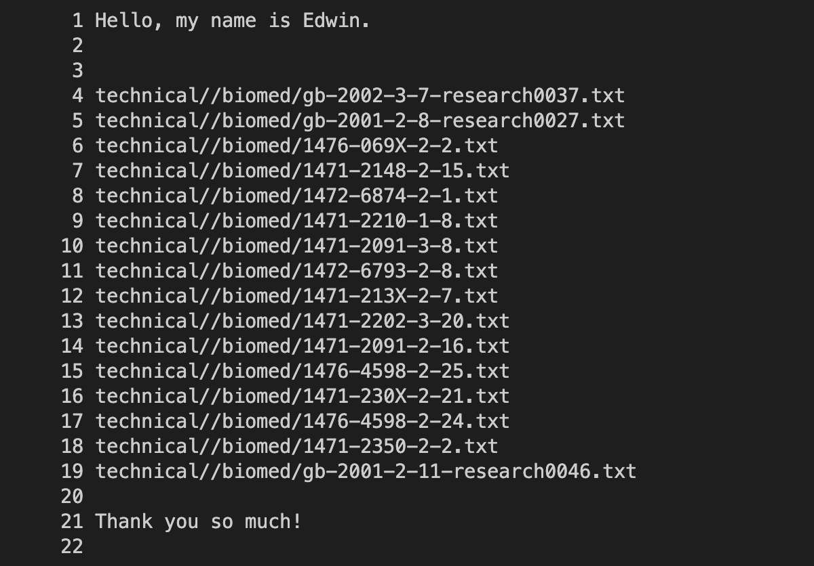
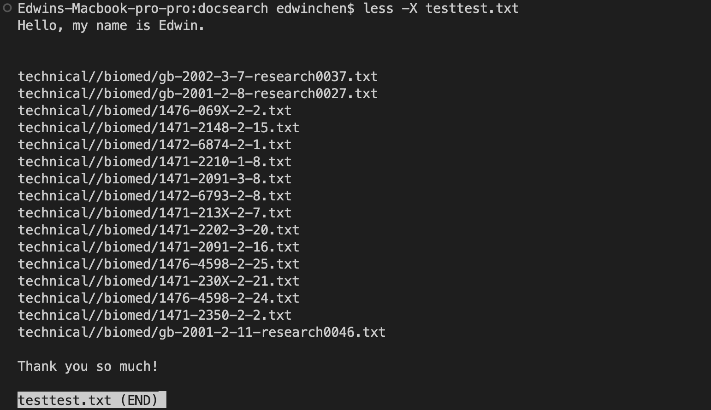

# Lab 3 report
# find command
1. Example: ```find ./technical -name chapter-1.txt```<br> 
The output: ```./technical/911report/chapter-1.txt```<br> 
The picture of the this example: <br>

Explanation: What this command does is finding a specific file in the directory and print out all the path. In this example we search chapter-1.txt and get ./technical/911report/chapter-1.txt, so we know it is in the 911report. It is useful because we can know where the file we want to search belong.<br> 
2.Example: ```find ./technical  -name chapter-1.txt -exec rm -i {} \;```<br>
The output: ```remove ./technical/911report/chapter-1.txt? y```<br> 
The picture of this example:

Explanation: This command let us remove a specific file in the directory and it will confirm again with you, when you type 'y' or 'Y' you will delete it. And finally we search if the file chapter-1.txt is still there using ```find ./technical -name chapter-1.txt``` , and it disappeared already. This is useful becasue we can delete some files we don't need in the terminal.<br>
3.Example: ```find ./technical  -empty```<br>
The output:<br>
The picture of this example:

Explanation: This command search the empty file in the directory, and since we don't have any empty files in it, the output shows nothing. It is useful because we can instanty know is there any empty file in the directory.

# less command
1. Example: ```less -N testtest.txt```<br> 
The output:<br>
```
      1 Hello, my name is Edwin.
      2 
      3 
      4 technical//biomed/gb-2002-3-7-research0037.txt
      5 technical//biomed/gb-2001-2-8-research0027.txt
      6 technical//biomed/1476-069X-2-2.txt
      7 technical//biomed/1471-2148-2-15.txt
      8 technical//biomed/1472-6874-2-1.txt
      9 technical//biomed/1471-2210-1-8.txt
     10 technical//biomed/1471-2091-3-8.txt
     11 technical//biomed/1472-6793-2-8.txt
     12 technical//biomed/1471-213X-2-7.txt
     13 technical//biomed/1471-2202-3-20.txt
     14 technical//biomed/1471-2091-2-16.txt
     15 technical//biomed/1476-4598-2-25.txt
     16 technical//biomed/1471-230X-2-21.txt
     17 technical//biomed/1476-4598-2-24.txt
     18 technical//biomed/1471-2350-2-2.txt
     19 technical//biomed/gb-2001-2-11-research0046.txt
     20 
     21 Thank you so much!
     22


 ```

The picture of the this example:


Explanation:

2. Example: ```less -N testtest.txt```<br> 
The output:
```
Hello, my name is Edwin.


technical//biomed/gb-2002-3-7-research0037.txt
technical//biomed/gb-2001-2-8-research0027.txt
technical//biomed/1476-069X-2-2.txt
technical//biomed/1471-2148-2-15.txt
technical//biomed/1472-6874-2-1.txt
technical//biomed/1471-2210-1-8.txt
technical//biomed/1471-2091-3-8.txt
technical//biomed/1472-6793-2-8.txt
technical//biomed/1471-213X-2-7.txt
technical//biomed/1471-2202-3-20.txt
technical//biomed/1471-2091-2-16.txt
technical//biomed/1476-4598-2-25.txt
technical//biomed/1471-230X-2-21.txt
technical//biomed/1476-4598-2-24.txt
technical//biomed/1471-2350-2-2.txt
technical//biomed/gb-2001-2-11-research0046.txt

Thank you so much!

```
The picture of the this example:

Explanation:

3.
Example: ```less -E find-results.txt```<br> 
The output:


